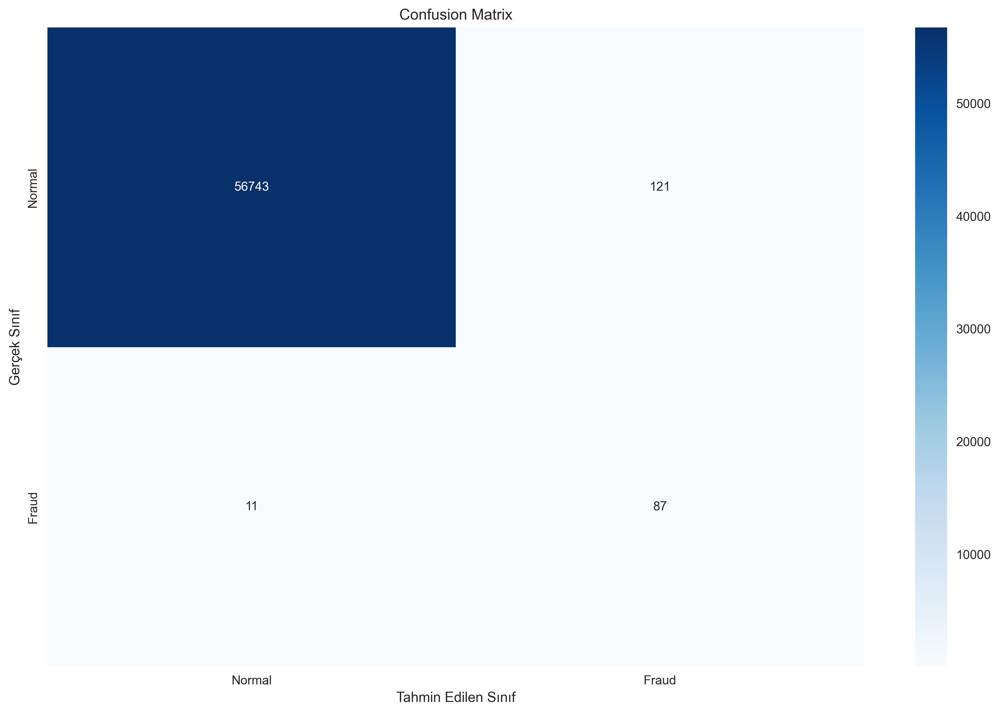
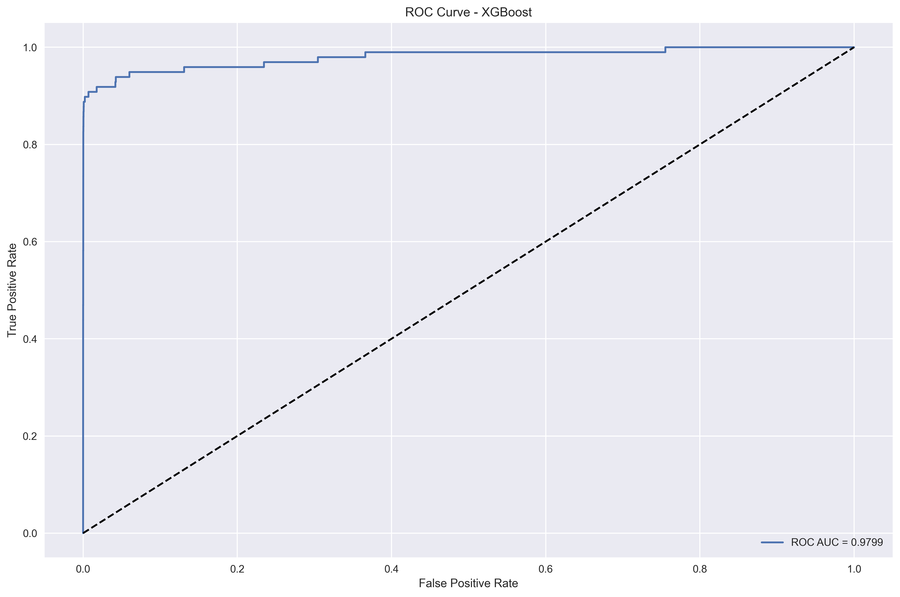
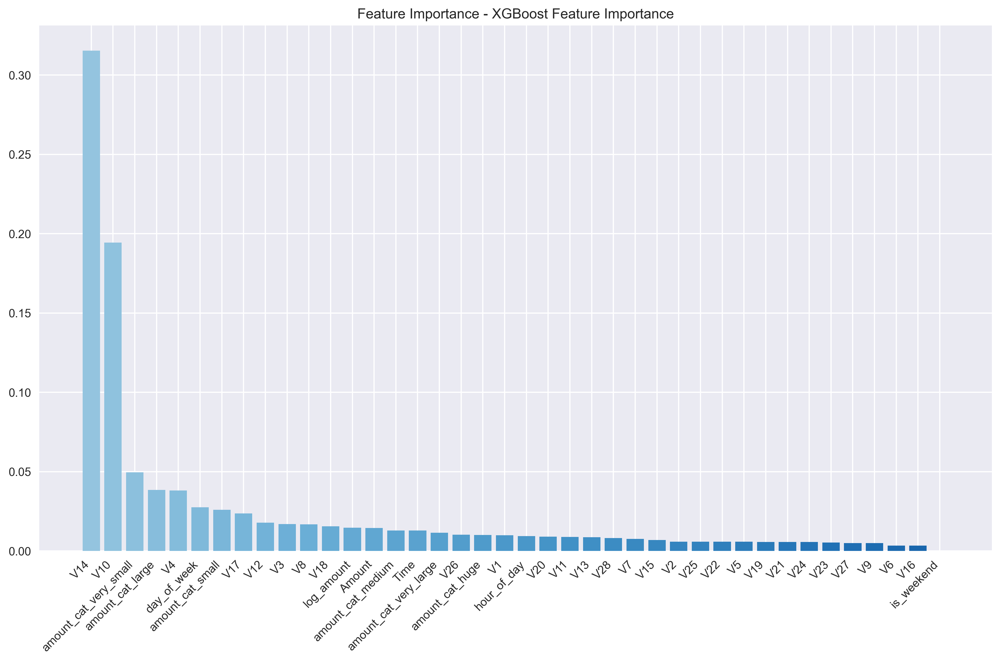
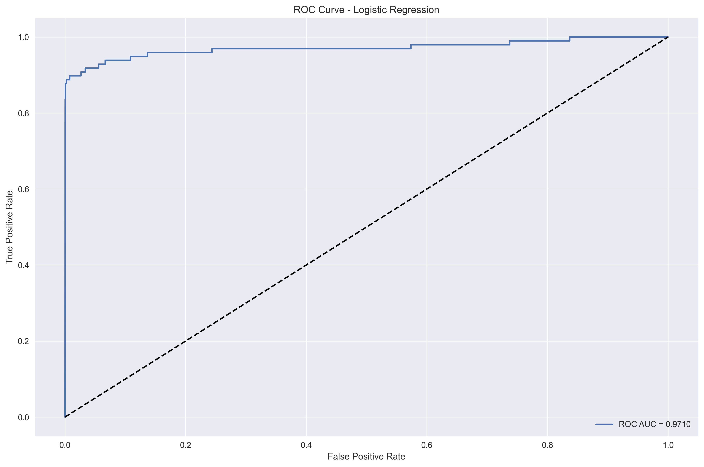
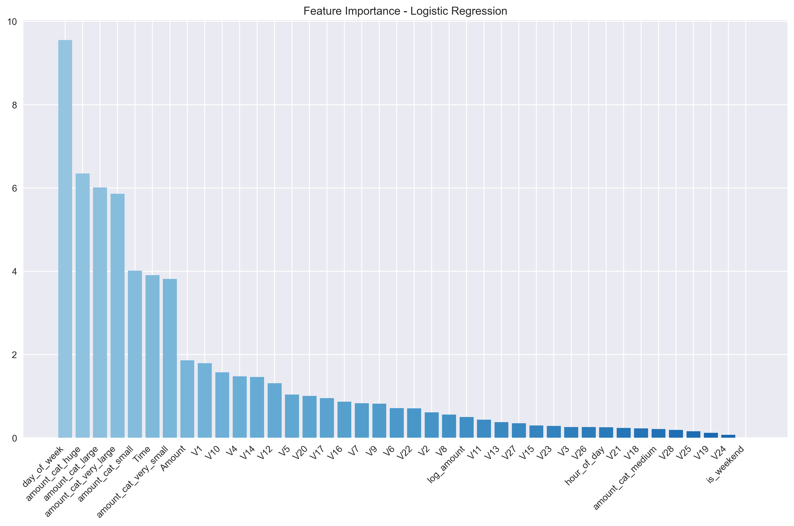
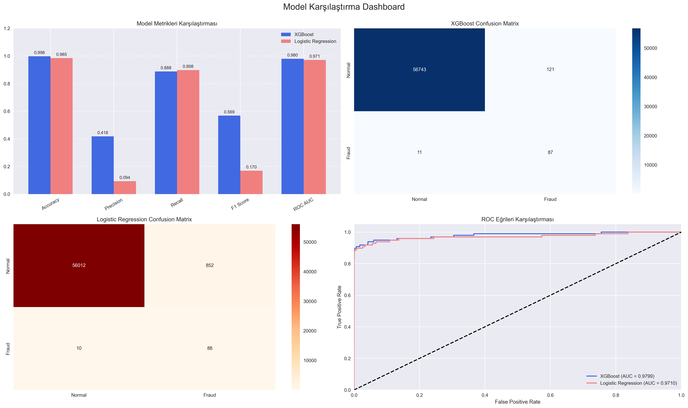

# Fraud Detection with Machine Learning

Bu proje, kredi kartı işlemlerindeki dolandırıcılık tespiti için makine öğrenmesi tabanlı bir sistem geliştirmeyi amaçlamaktadır. XGBoost ve Logistic Regression modelleri kullanılarak, yüksek doğruluk oranıyla dolandırıcılık tespiti yapılmaktadır.

## 📊 Proje Özeti

Proje, aşağıdaki ana bileşenlerden oluşmaktadır:

- Veri Keşfi ve Analizi (EDA)
- Veri Ön İşleme
- Model Eğitimi ve Optimizasyon
- Model Değerlendirme ve Görselleştirme

## 🛠️ Teknolojiler

- Python 3.8+
- Pandas, NumPy
- Scikit-learn
- XGBoost
- Matplotlib, Seaborn
- Jupyter Notebook

## 📈 Model Performansı

### XGBoost Modeli





### Logistic Regression Modeli





### Model Karşılaştırması



## 🎯 Önemli Metrikler

- **XGBoost Modeli:**
  - ROC AUC Score: 0.9799
  - Average Precision: 0.8222
  - Accuracy: 0.9998

- **Logistic Regression Modeli:**
  - ROC AUC Score: 0.9723
  - Average Precision: 0.7845
  - Accuracy: 0.9992

## 🚀 Kurulum

1. Projeyi klonlayın:
```bash
git clone https://github.com/haremir/fraud_eye.git
cd fraud_eye
```

2. Gerekli paketleri yükleyin:
```bash
pip install -r requirements.txt
```

3. Jupyter Notebook'ları çalıştırın:
```bash
jupyter notebook notebooks/
```

## 📝 Kullanım

1. `notebooks/eda.ipynb`: Veri keşfi ve analizi
2. `notebooks/preprocessing.ipynb`: Veri ön işleme
3. `notebooks/model_training.ipynb`: Model eğitimi
4. `notebooks/evaluation.ipynb`: Model değerlendirme

## 🔍 Özellikler

- İki farklı model ile karşılaştırmalı analiz
- Kapsamlı model değerlendirme metrikleri
- Detaylı görselleştirmeler
- Özellik önemliliği analizi
- Model versiyonlama
- Modüler ve sürdürülebilir kod yapısı

## 📊 Veri Seti

Proje, kredi kartı işlemlerini içeren bir veri seti kullanmaktadır. Veri seti şu özellikleri içermektedir:
- İşlem tutarı
- Zaman damgası
- İşlem türü
- Ve diğer özellikler...

## 🤝 Katkıda Bulunma

1. Bu depoyu fork edin
2. Yeni bir branch oluşturun (`git checkout -b feature/amazing-feature`)
3. Değişikliklerinizi commit edin (`git commit -m 'Add some amazing feature'`)
4. Branch'inizi push edin (`git push origin feature/amazing-feature`)
5. Bir Pull Request oluşturun

## 📄 Lisans

Bu proje MIT lisansı altında lisanslanmıştır. Detaylar için [LICENSE](LICENSE) dosyasına bakın.

## 📧 İletişim

- GitHub: [@haremir](https://github.com/haremir)
- LinkedIn: [Harun Emirhan Bostancı](https://www.linkedin.com/in/haremir826/)
- Blog: [Veri Bilimi Yolculuğu](https://haremir.blogspot.com/)

Proje Linki: [https://github.com/haremir/fraud_eye](https://github.com/haremir/fraud_eye)
